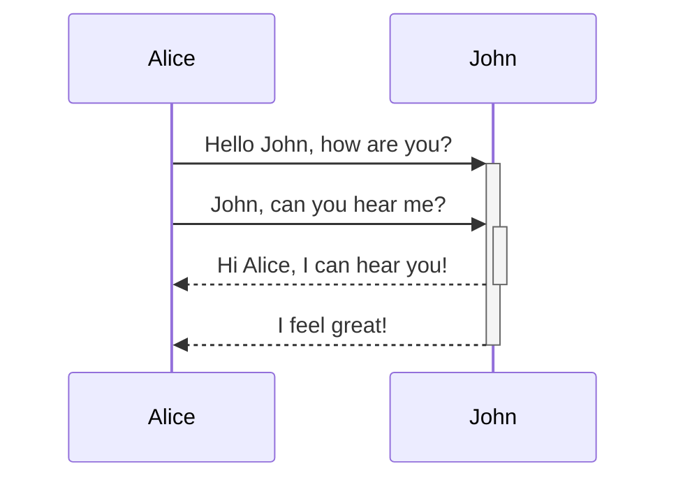
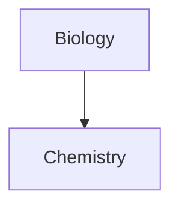

---
tags:
  - obsidian
  - 语法
obsidianUIMode: preview
---

# 表

可以使用竖线 `|` 和连字符 `-` 创建表格。竖线分隔列，连字符定义列标题。

```md
| 名字   | 姓     |
|  ---  | ----- |
| 麦克斯 | 普 朗 克 |
| 玛丽  | 居里    |
```

| 名字  | 姓     |
| --- | ----- |
| 麦克斯 | 普 朗 克 |
| 玛丽  | 居里    |

单元格两测对齐是可选的。

单元格不需要与管道符完美对齐。每个标题行必须至少有两个连字符。

```md
First name | Last name
-- | --
Max | Planck
Marie | Curie
```

## 设置表格中内容的格式

可以使用[[Obsidian/语法/基本语法|基本语法]]来设置表中内容的样式。


表格中的垂直条

如果要使用**别名**或**调整表格中图像**的大小，则需要在垂直条之前添加一个`\`

```md
First column | Second column
-- | --
[[Basic formatting syntax\|Markdown syntax]] | ![[og-image.png\|200]]
```

| 第一列                              | 第二列                                                          |
| -------------------------------- | ------------------------------------------------------------ |
| [[Obsidian/语法/基本语法\|Markdown语法]] | ![[Obsidian/语法/assets/Pasted image 20240531150047.png\|200]] |

可以通过在标题行中添加冒号 `:` 来将文本与列的左侧、右侧或中心对齐。

```md
Left-aligned text | Center-aligned text | Right-aligned text
:-- | :--: | --:
Content | Content | Content
```

|左对齐文本|居中对齐的文本|右对齐文本|
|:--|:-:|--:|
|内容|内容|内容|

# Mermaid

您可以使用 [Mermaid](https://mermaid-js.github.io/)将图表添加到笔记中。Mermaid 支持一系列图表，例如**流程图**、**序列图**和**时间线**。

> [!tip] 提示
> 可以尝试 Mermaid [的实时编辑器](https://mermaid-js.github.io/mermaid-live-editor)来帮助您构建图表，然后再将它们包含在笔记中。
> 若要添加图，请创建 [[Obsidian/语法/基本语法#代码块]]。`mermaid`

````md

````


````md

````


---
## 链接关系图中的文件

可以通过将[类](https://mermaid.js.org/syntax/flowchart.html#classes)附加到节点来在关系图中创建[内部链接](https://help.obsidian.md/Linking+notes+and+files/Internal+links)。`internal-link`

````md

````


> [!tip] 注意
> 图表中的内部链接不会显示在**关系图谱**中。
> 如果关系图中有多个节点，则可以使用以下代码片段。

````md

````

这样，每个字母节点都成为一个内部链接，[节点文本](https://mermaid.js.org/syntax/flowchart.html#a-node-with-text)作为链接文本。

> [!tip] 注意
> 如果在注释名称中使用特殊字符，则需要将注释名称放在双引号中。
> ```
> class "⨳ special character" internal-link
> ```
>或`A["⨳ special character"]`

---
# 数学

您可以使用 [MathJax](http://docs.mathjax.org/en/latest/basic/mathjax.html) 和 LaTeX 符号将数学表达式添加到您的笔记中。

要将 MathJax 表达式添加到笔记中，用双美元符号 `$$` 将其括起来。

```md
$$
\begin{vmatrix}a & b\\
c & d
\end{vmatrix}=ad-bc
$$
```

$$
\begin{vmatrix}a & b\\
c & d
\end{vmatrix}=ad-bc
$$

还可以通过 `$` 将数学表达式包装在符号中来内联数学表达式。

```md
This is an inline math expression $e^{2i\pi} = 1$.
```

这是一个内联数学表达式 $e^{2i\pi} = 1$。

---
# 属性

属性允许您组织有关注释的信息。属性包含结构化数据，例如文本、链接、日期、复选框和数字。

## 属性格式

属性以**YAML**格式存储在文件顶部。YAML 是一种广泛使用的格式，人类和机器都可以阅读。

属性名称与其值之间用冒号分隔，后跟空格：

```yaml
---
name: value
---
```

虽然每个名称-值对的顺序无关紧要，但每个名称在注释中必须是唯一的。例如，您不能拥有多个属性。`tags`

值可以是文本、数字、true 或 false，甚至可以是值（数组）的集合。  

```yaml
---
title: A New Hope # This is a text property
year: 1977
favorite: true
cast: # This is a list property
  - Mark Hamill
  - Harrison Ford
  - Carrie Fisher
---
```

**文本**和**列表**类型属性中的内部链接必须用引号括起来。如果手动在属性中输入内部链接，Obsidian 会自动添加这些链接，但在使用模板插件时要小心添加它们。

```yaml
---
link: "[[Link]]" 
linklist: 
  - "[[Link]]" 
  - "[[Link2]]"
---
```

数字类型属性必须始终为整数。整数可以包含小数点，但不能包含运算符。  

```yaml
---
year: 1977
pie: 3.14
---
```

复选框类型属性为 `true` 或 `false`。空属性将被视为 `false`。在实时预览中，这将表示为复选框。    

```yaml
---
favorite: true
reply: false
last: # this will default to false
---
```

**“日期****”和“日期&时间**”类型属性按以下格式存储：  

```yaml
---
date: 2020-08-21
time: 2020-08-21T10:30:00
---
```

日期选取器遵循操作系统的默认日期和时间格式。可以在系统偏好设置中更改它：

## 默认属性
Obsidian 带有一组默认属性：

| 属性           | 介绍                              |
| ------------ | ------------------------------- |
| `tags`       | 见[[#标签]]                        |
| `aliases`    | 别名                              |
| `cssclasses` | 允许你使用以下方式来设置单个笔记的样式CSS snippets |

---
# 标签

标签是关键字或主题，可帮助快速找到所需的笔记。

## 向备忘录添加标签

要创建标签，请在编辑器中输入符号 `#`，后跟关键字。例如 `#meeting`。

可以使用[[#属性]] `tags` 添加标记。YAML 中的标记应始终格式化为列表：

```yaml
---
tags:
  - recipe
  - cooking
---
```

## 使用标签查找笔记

要使用**搜索**插件查找笔记，在搜索词中使用[[#搜索运算符]]，例如 `tag:#meeting`。

还可以通过在笔记中单击标签来搜索标签。

## 嵌套标签

嵌套标签定义了标签层次结构，以便更轻松地查找和筛选相关标签。

在标签名称中使用正斜杠 `/` 创建嵌套标签，例如 `#inbox/to-read` 和  `#inbox/processing`

## 标签格式

可以在代码中使用以下任意字符：

- 按字母顺序排列的字母
- 数字
- 下划线 （`_`)
- 连字符 （`-`)
- **嵌套标签**的正斜杠 （）`/`

标签必须至少包含一个非数字字符。例如，` #1984` 不是有效的标记，但 `#y1984` 是。

标记不区分大小写。例如，`#tag` 和  ` #TAG ` 将被视为相同。

标签不能包含空格。若要分隔两个或多个单词，可以改用以下格式：

- `#camelCase`
- `#PascalCase`
- `#snake_case`
- `#kebab-case`

# 标注

使用标注来包含其他内容，而不会中断笔记的流程。

要创建标注，请在块引用的第一行添加 `[!info]` 类型标识符 `info`。类型标识符决定了标注的外观和感觉。若要查看所有可用类型，请参阅[[#支持的类型]]。

```markdown
> [!info]
> Here's a callout block.
> It supports **Markdown**, [[Internal link|Wikilinks]], and [[Embed files|embeds]]!
> ![[Engelbart.jpg]]
```

> [!info]
> Here's a callout block.
> It supports **Markdown**, Wikilinks, and embeds!
> ![[Obsidian/语法/assets/Pasted image 20240531150047.png]]


## 更改标题

默认情况下，标注的标题是其标题大小写的类型标识符。您可以通过在类型标识符后添加文本来更改它：

```markdown
> [!tip] Callouts can have custom titles
> Like this one.
```


> [!tip] Callouts can have custom titles
> Like this one.
> 可以具有自定义标题。

像这个，甚至可以省略正文以创建仅限标题的标注：

```markdown
> [!tip] Title-only callout
```

> [!tip] Title-only callout

## 可折叠标注

您可以通过在类型标识符后直接添加加号 （+） 或减号 （-） 来使标注可折叠。

默认情况下，加号会展开标注，而减号会折叠标注。

```markdown
> [!faq]- Are callouts foldable?
> Yes! In a foldable callout, the contents are hidden when the callout is collapsed.
```

> [!faq]- Are callouts foldable?
> Yes! In a foldable callout, the contents are hidden when the callout is collapsed.


## 嵌套标注

可以在多个级别中嵌套标注。

```markdown
> [!question] Can callouts be nested?
> > [!todo] Yes!, they can.
> > > [!example]  You can even use multiple layers of nesting.
```

> [!question] Can callouts be nested?
> > [!todo] Yes!, they can.
> > > [!example]  You can even use multiple layers of nesting.

## 支持的类型

可以使用多种标注类型和别名。每种类型都有不同的背景颜色和图标。

若要使用这些默认样式，请在示例中替换为以下任一类型，例如或。`info` `[!tip]` `[!warning]`

---

`note`

> [!note]
> Lorem ipsum dolor sit amet

---
`abstract`

> [!abstract]
> Lorem ipsum dolor sit amet

Aliases: `summary`, `tldr`

---

`info`

> [!info]
> Lorem ipsum dolor sit amet

---

`todo`

> [!todo]
> Lorem ipsum dolor sit amet

---

`tip`

> [!tip]
> Lorem ipsum dolor sit amet

Aliases: `hint`, `important`

---

`success`

> [!success]
> Lorem ipsum dolor sit amet

Aliases: `check`, `done`

---

`question`

> [!question]
> Lorem ipsum dolor sit amet

Aliases: `help`,  `faq`

---

`warning`

> [!warning]
> Lorem ipsum dolor sit amet

Aliases: `caution`, `attention`

---

`failure`

> [!failure]
> Lorem ipsum dolor sit amet

Aliases: `fail`, `missing`

---

`danger`

> [!danger]
> Lorem ipsum dolor sit amet

Alias: `error`

---

`bug`

> [!bug]
> Lorem ipsum dolor sit amet

---

`example`

> [!example]
> Lorem ipsum dolor sit amet

---

`quote`

> [!quote]
> Lorem ipsum dolor sit amet

Alias: `cite`

# 搜索运算符

| 搜索运算符          | 描述                                                                                                               |
| -------------- | ---------------------------------------------------------------------------------------------------------------- |
| `file:`        | 在文件名中查找文本。匹配 Vault 中的任何文件。<br><br>示例：或 . `file:.jpg` `file:202209`                                               |
| `path:`        | 在文件路径中查找文本。匹配 Vault 中的任何文件。<br><br>例：。`path:"Daily notes/2022-07"`                                               |
| `content:`     | 在文件内容中查找文本。<br><br>例：。`content:"happy cat"`                                                                      |
| `match-case:`  | 区分大小写的匹配。<br><br>例：。`match-case:HappyCat`                                                                        |
| `ignore-case:` | 不区分大小写的匹配。<br><br>例：。`ignore-case:ikea`                                                                          |
| `tag:`         | 在文件中查找标签。<br><br>例：。`tag:#work`<br><br>**注意**：由于会忽略代码块和非 Markdown 内容中的匹配项，因此它通常比普通的全文搜索更快、更准确。`tag:``#work`      |
| `line:`        | 在同一行上查找匹配项。<br><br>例：。`line:(mix flour)`                                                                         |
| `block:`       | 在同一块中查找匹配项。<br><br>例：。`block:(dog cat)`<br><br>**注意**：由于需要搜索来解析每个文件中的 Markdown 内容，因此可能会导致搜索词需要更长的时间才能完成。`block:` |
| `section:`     | 在同一部分（两个标题之间的文本）中查找匹配项。<br><br>例：。`section:(dog cat)`                                                            |
| `task:`        | 逐块查找任务中的匹配项。<br><br>例：。`task:call`                                                                               |
| `task-todo:`   | 在未_完成_的任务]中逐块查找匹配项。<br><br>例：。`task-todo:call`                                                                   |
| `task-done:`   | 在_已完成_的任务中逐块查找匹配项。<br><br>例：。`task-done:call`                                                                    |


---
[[Obsidian/语法/基本语法|基本语法]]
